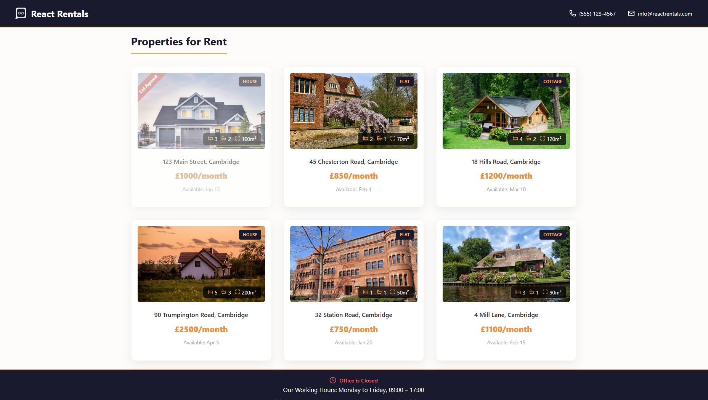

<h1>React Rentals</h1>

https://react-rentals.netlify.app/

React Rentals is a beginner-friendly showcase project that illustrates how to build UI using `React components` and pass data between them using `props`. It focuses on understanding component structure and best practices for organizing a small React app.

## 👍 My Challenges:

- I focused on creating a clean and aesthetically pleasing layout.
- Implemented a scroll-down behavior when the “Browse Properties” button is clicked.
- Added a popup modal that opens when the “Contact Us” button is clicked.
- Designed the application to be responsive across different screen sizes.

## 🎉 Build With:

- React JS
- Semantic HTML5 markup
- CSS Flexbox and Grid
- Mobile-first workflow
- Custom CSS properties
